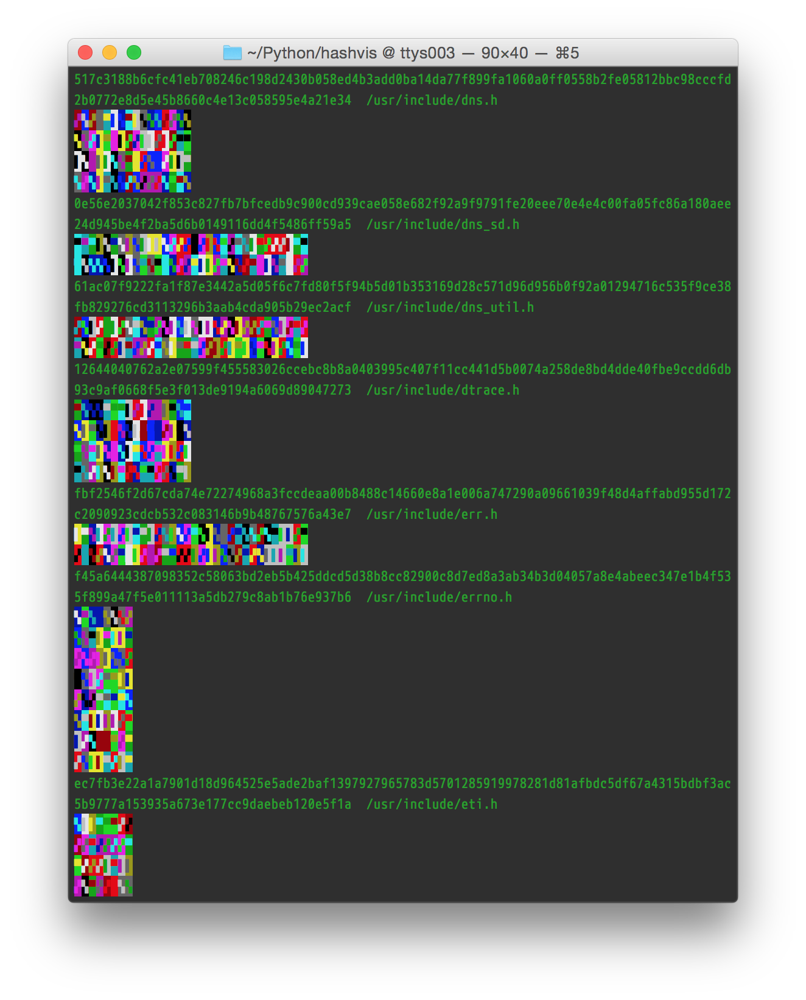

# hashvis
## Visualize MD5, SHA1, SHA256, SHA512, etc. hashes

Those digests sure are hard to read, aren't they? Moreover, they're hard to *compare*. You can skim, but are you sure you didn't miss a byte? Comparing most of the bytes is good enough… right?

What if there was a better way?

Now, for those with color monitors and color vision, there is.

hashvis will parse hashes from standard input and visualize them as blocks of color. You'll need xterm-16color or better, and UTF-8 support.

(Strictly speaking, hashvis is only looking for a string of hex digits at the start of the line. It does not care what hash you use; as long as it's represented in hex, hashvis is happy.)

## What if I can't see color?

hashvis also uses different characters for each input byte, and chooses the aspect ratio of the generated “image” based on the last byte of the hash. These two features are not dependent on color.

I'd definitely be interested in a patch that makes this tool more monochrome-friendly. Simply not printing color codes might work, but currently sacrifies 75% of the bits of the hash, since there are only four characters used and hashvis only uses (two bits of) each input byte to select each output character.

A better patch might add more different characters, at least in monochrome mode, and/or print more characters per byte in monochrome mode.
